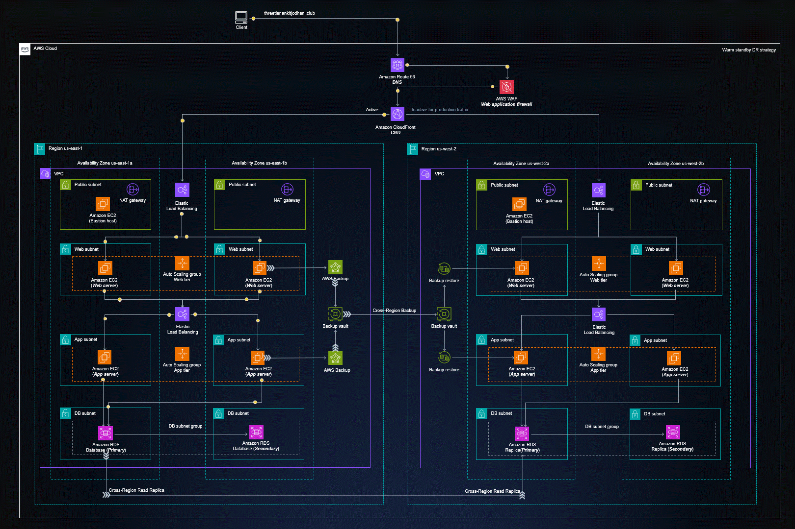

    <h1 align="center">Hi, I'm M.Han OZTURK</h1>

    <h3 align="center">A passionate DevOps Engineer from Istanbul / TURKIYE</h3>

- 🌱 I’m currently learning __AWS Cloud Architect / DevOps Engineering__
- 👨‍💻 All of my projects are available at __https://github.com/muslumhanozturk__
- 💬 Ask me about __AWS, Docker, Kubernetes, Terraform, Ansible, Jenkins, Prometheus, Grafana__  ...
- 📫 How to reach me: __muslumhanozturk@gmail.com__
- 📄 Know about my experiences __https://www.linkedin.com/in/muslumhanozturk__

<h3 align="left">Connect with me:</h3>
<table>
  <tr>
    <td>
      
    </td>
    <td>
      
    </td>
  </tr>
</table>

<h3 align="left">Languages and Tools:</h3>

  <table>
  <tr>
    <td>
      <a href="https://code.visualstudio.com/" title="Visual Studio Code" target="_blank" rel="noreferrer">
        
    </td>
    <td>
      
    </td>
    <td>
      
    </td>
    <td>
      
    </td>
    <td>
      
    </td>
    <td>
      
    </td>
    <td>
      
    </td>
    <td>
      
    </td>
    <td>
      
    </td>
    <td>
      
    </td>
    <td>
      
    </td>
    <td>
      
    </td>
    <td>
      
    </td>
    <td>
        
    </td>
  </tr>
</table>

  <table>
  <tr>
    <td>
      
    </td>
    <td>
      
    </td>
    <td>
      
    </td>
    <td>
      
    </td>
    <td>
      
    </td>
    <td>
      
    </td>
    <td>
      
    </td>
    <td>
      
    </td>
    <td>
      
    </td>
    <td>
      
    </td>
    <td>
      
    </td>
    <td>
      
    </td>
    <td>
        
    </td>
    <td>
        
    </td>    
  </tr>
</table>

<!--  -->
<!-- 

    

 -->

<table>
  <tr>
    <td>
      
    </td>
    <td>
      
    </td>
  </tr>
</table>

<!-- ## :trophy: GitHub Trophies
 -->

        
[Click Me..!](https://muslumhanozturk.github.io) 

<!--  -->

<!--  -->

  

  

