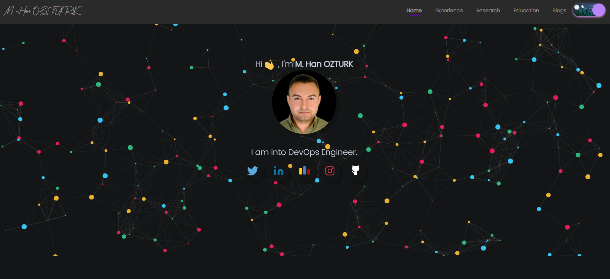
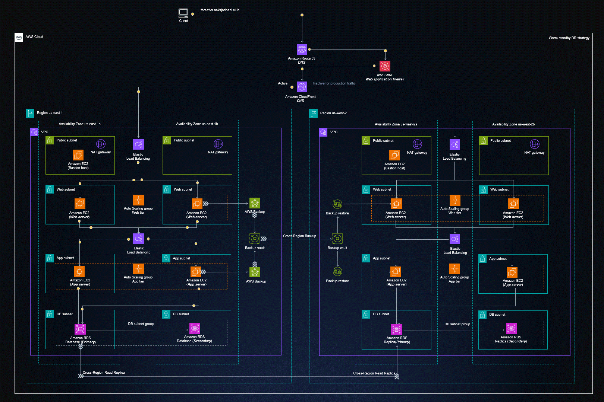

    <h1 align="center">Hi</a>, I'm M.Han OZTURK</h1>

    <h3 align="center">A passionate DevOps Engineer from Istanbul / TURKIYE</h3>

- 🌱 I’m currently learning __AWS Cloud Architect / DevOps Engineering__
- 👨‍💻 All of my projects are available at __https://github.com/muslumhanozturk__
- 💬 Ask me about __AWS, Docker, Kubernetes, Terraform, Ansible, Jenkins, Prometheus, Grafana__  ...
- 📫 How to reach me: __muslumhanozturk@gmail.com__
- 📄 Know about my experiences __https://www.linkedin.com/in/muslumhanozturk__

<h3 align="left">Connect with me:</h3>
<table>
  <tr>
    <td>
      
    </td>
    <td>
      
    </td>
    <td>
      
    </td>
  </tr>
</table>

<h3 align="left">Languages and Tools:</h3>

<table align="center">
  <tr>
    <td align="center" width="96">
        
       AWS
    </td>
    <td align="center" width="96">
        
       Docker
    </td>
    <td align="center" width="96">
        
       Kubernetes
    </td>
    <td align="center" width="96">
        
       OpenShift
    </td>
    <td align="center" width="96">
        
       Terraform
    </td>
    <td align="center" width="96">
        
       Ansible
    </td>
    <td align="center" width="96">
        
       Jenkins
    </td>
    <td align="center" width="96">
        
       ArgoCD
    </td>
    <td align="center" width="96">
        
       Jaeger
  </tr>
  <tr>
    <td align="center" width="96">
        
       Github
    </td>
    <td align="center" width="96">
        
       Git
    </td>
    <td align="center" width="96">
        
       Linux
    </td>
    <td align="center" width="96">
        
       Python
    </td>
    <td align="center" width="96">
        
       Bash Script
    </td>
    <td align="center" width="96">
        
       VsCode
    </td>
    <td align="center" width="96">
        
       SonarQube
    </td>
    <td align="center" width="96">
        
       Prometheus
    <td align="center" width="96">
        
       Grafana
    </td>
    </td>
    </td>
  </tr>
 <tr>
     <td align="center"  width="96">
        
       HTML5
    </td>
    <td align="center" width="96">
        
       CSS
    </td>
 </tr>
</table>
  

<table>
  <tr>
    <td>
      
    </td>
    <td>
      
    </td>
  </tr>
</table>

        
[Click Me..!](https://muslumhanozturk.github.io) 

  

  

